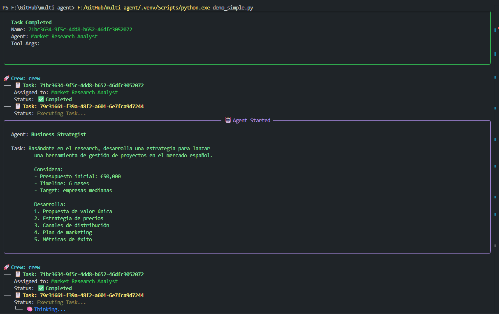
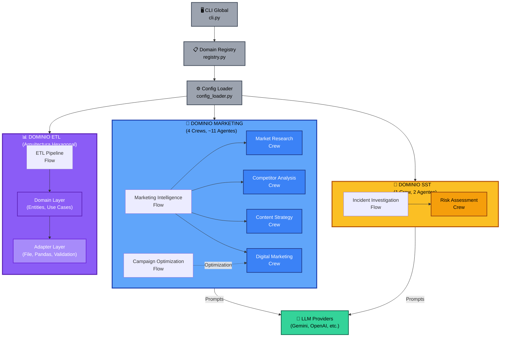
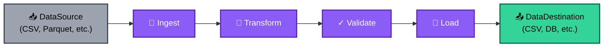

# 🤖 Multi-Agent System con CrewAI

[](https://www.python.org/downloads/)
[](https://github.com/crewAIInc/crewAI)
[](https://opensource.org/licenses/MIT)
[](https://github.com/psf/black)
[](https://github.com/lraigosov/multi-agent)

Un sistema multi-dominio de agentes autónomos desarrollado con **CrewAI** que aborda problemas complejos mediante la colaboración de agentes especializados de IA. Actualmente implementa tres dominios funcionales: **Marketing Digital** (análisis de mercado, estrategia competitiva y optimización de campañas), **SST - Seguridad y Salud en el Trabajo** (evaluación de riesgos, cumplimiento normativo e investigación de incidentes) y **ETL** (procesamiento de datos con arquitectura hexagonal).

> **⚠️ PROYECTO EXPERIMENTAL**  
> Este es un proyecto de aprendizaje y experimentación sobre **agent builders** y sistemas multi-agente autónomos. Forma parte de mi exploración práctica de frameworks especializados en orquestación de agentes IA, sus capacidades de reasoning, memoria contextual y colaboración inter-agente.
> 
> **¿Por qué CrewAI y no herramientas como n8n?**  
> Aunque [n8n](https://n8n.io/) es una excelente plataforma de automatización low-code con capacidades de IA, está fundamentalmente diseñada para **workflows deterministas** con nodos predefinidos. CrewAI, por otro lado, representa un paradigma diferente:
> 
> - **Autonomía vs. Determinismo**: Los agentes en CrewAI toman decisiones autónomas basadas en sus objetivos, no siguen rutas fijas
> - **Reasoning Nativo**: Cada agente tiene capacidad de razonamiento, planificación y adaptación usando LLMs
> - **Memoria Contextual**: Los agentes mantienen contexto entre tareas y pueden aprender de interacciones previas
> - **Colaboración Emergente**: Los agentes se comunican, delegan tareas y coordinan acciones de forma natural
> - **Especialización Profunda**: Cada agente puede ser un experto en su dominio con herramientas especializadas
> 
> n8n + IA es potente para automatizar procesos conocidos y conectar servicios. CrewAI es potente para **resolver problemas complejos** que requieren análisis, creatividad y toma de decisiones autónomas. Son herramientas complementarias, no competidoras.
> 
> Este proyecto sirve como laboratorio para entender las capacidades y limitaciones de los agent builders modernos en escenarios reales de negocio.

## ✅ Sistema Funcionando


*Ejemplo de ejecución: Análisis de mercado español con 3 agentes coordinados (Market Researcher → Strategist → Content Creator)*

**Estado:** Dominios implementados (marketing, SST, ETL) con demos incluidas.  
**Modelo usado en demos:** Google Gemini 2.5 Flash (gratuito).  
**Verificado en esta sesión:** `examples/demo_etl.py` ejecutó OK (pipeline determinista).  
Marketing y SST cuentan con demos y crews registrados; no se volvieron a ejecutar en esta sesión.

## 🎯 Características Principales

### 🏗️ Arquitectura Multi-Dominio
- **Marketing Digital**: Análisis de mercado, competencia y optimización de campañas (4 crews, ~11 agentes)
- **SST (Seguridad y Salud en el Trabajo)**: Evaluación de riesgos, cumplimiento normativo e investigación de incidentes (1 crew funcional)
- **ETL**: Procesamiento de datos con arquitectura hexagonal (Ports & Adapters, sin LLMs)
- **Escalabilidad**: Arquitectura preparada para adición de nuevos dominios
- **CLI Global**: Gestión unificada desde la raíz del repositorio

### 🤖 Dominio Marketing - Crews y Agentes
**Market Research Crew:**
- Market Researcher: Análisis profundo de mercado y tendencias
- Audience Analyst: Segmentación y análisis de audiencia

**Competitor Analysis Crew:**
- Competitor Analyst: Investigación competitiva y benchmarking
- Content Analyst: Auditoría de estrategias de contenido

**Content Strategy Crew:**
- Content Creator: Creación y planificación de contenido
- SEO Specialist: Optimización para motores de búsqueda
- Copywriter: Creación de copy persuasivo

**Digital Marketing Crew:**
- Marketing Strategist: Desarrollo de estrategias integrales
- Campaign Manager: Gestión y optimización de campañas
- Data Analyst: Análisis de métricas y performance

### 🦺 Dominio SST - Crews y Agentes
**Risk Assessment Crew:**
- Risk Analyst: Identificación y evaluación de riesgos laborales
- Compliance Officer: Verificación de cumplimiento normativo

**Flows:**
- Incident Investigation Flow: Orquestación de investigaciones de incidentes (arquitectura de flujo lista)

### 📊 Dominio ETL
**Arquitectura Hexagonal (Ports & Adapters):**
- Domain Layer: Entidades (DataSource, DataBatch, TransformationJob, DataDestination)
- Use Cases: IngestData, TransformData, LoadData, ReconcileJobResult
- Adapters: FileSourceAdapter, PandasTransformAdapter, ValidationAdapter, FileDestinationAdapter
- ETL Pipeline Flow: Orquestación de pipeline (Ingest → Transform → Validate → Load)

### 🚀 Flows Funcionales
**Marketing:**
- **Marketing Intelligence Flow**: Coordinación de 4 crews (Market Research → Competitor Analysis → Content Strategy → Digital Marketing)
- **Campaign Optimization Flow**: Optimización de campañas existentes

**SST:**
- **Incident Investigation Flow**: Orquestación de investigación de incidentes

**ETL:**
- **ETL Pipeline Flow**: Procesamiento completo de datos (sin dependencia de LLMs)

## 🧪 Proyecto Experimental

### Objetivo
Exploración práctica de **sistemas multi-agente autónomos** con CrewAI, evaluando arquitecturas, patrones de coordinación y casos de uso en dominios reales (Marketing, SST, ETL).

### Contexto
Este repositorio documenta una comparación práctica entre frameworks especializados en agentes IA (CrewAI, LangGraph) vs. orquestadores tradicionales de workflows (n8n, Make, Zapier). CrewAI sobresale en problemas que requieren **análisis multi-perspectiva, reasoning dinámico y toma autónoma de decisiones**, mientras que n8n es superior para **workflows deterministas y integraciones simples**.

### Estado Actual
- ✅ **Marketing Domain**: 4 crews funcionales, flujos de orquestación completos, demos probadas con Gemini 2.5 Flash
- ✅ **SST Domain**: 1 crew funcional, flujo de investigación base, documentación detallada
- ✅ **ETL Domain**: Pipeline funcional con arquitectura hexagonal, sin dependencia de LLMs
- ✅ **CLI Global**: Sistema multi-dominio de registro y ejecución dinámico

### Limitaciones Conocidas
- **No determinístico**: Resultados pueden variar entre ejecuciones (por diseño de LLMs)
- **Costo**: Múltiples llamadas a LLMs vs. workflows simples
- **Latencia**: Coordinación inter-agente añade tiempo de ejecución
- **Debugging**: Rastreo del "por qué" de decisiones de agente es más complejo

### Recomendaciones de Uso
- ✅ **Usar para**: Análisis complejos, estrategia, evaluación multi-dominio, problemas creativos
- ❌ **Evitar en**: Procesos deterministas críticos, presupuestos muy limitados, cero tolerancia a variabilidad
- 🔄 **Hybrid**: Combinar workflows deterministas (ETL, integraciones) con agent reasoning (análisis, estrategia)

## 📋 Tabla de Contenidos

- [Características Principales](#-características-principales)
- [Instalación](#-instalación)
- [Configuración](#-configuración)
- [Uso Rápido](#-uso-rápido)
- [Arquitectura](#-arquitectura)
- [Ejemplos Funcionales](#-ejemplos-funcionales)
- [API Reference](#-api-reference)
- [Contribución](#-contribución)
- [Licencia](#-licencia)

## 🚀 Instalación

### Prerrequisitos
- Python 3.10 o superior
- Poetry (recomendado) o pip
- API key para LLM (OpenAI, Google Gemini, etc.)
- API key para Serper (opcional, solo si usas búsquedas web en agentes)

### Opción 1: Con Poetry (Recomendado)

```bash
# Clonar el repositorio
git clone https://github.com/lraigosov/multi-agent.git
cd multi-agent

# Instalar dependencias con Poetry
poetry install

# Activar entorno virtual
poetry shell
```

### Opción 2: Con pip

```bash
# Clonar el repositorio
git clone https://github.com/lraigosov/multi-agent.git
cd multi-agent

# Crear entorno virtual
python -m venv venv
source venv/bin/activate  # En Windows: venv\Scripts\activate

# Instalar dependencias
pip install -r requirements.txt
```

### Opción 3: Instalación Editable (Para Desarrollo)

```bash
# Después de clonar el repositorio
cd multi-agent
pip install -e .
```

## ⚙️ Configuración

### 1. Variables de Entorno

```bash
cp .env.example .env
```

Configura al menos una API de IA generativa (requerida):

```env
# 🤖 LLM Provider (REQUERIDO - elige uno)
OPENAI_API_KEY=sk-...                          # OpenAI GPT-4o
GOOGLE_API_KEY=...                             # Google Gemini (recomendado - gratis)
ANTHROPIC_API_KEY=sk-ant-...                   # Anthropic Claude

# 🔍 APIs Opcionales
SERPER_API_KEY=...                             # Google Search API (opcional)

# ⚙️ Configuración Sistema
CREWAI_TELEMETRY_OPT_OUT=true
DEBUG=false
```

### 2. Opciones de LLM

El sistema soporta múltiples proveedores. **Necesitas al menos uno configurado**. Consulta precios oficiales (cambian con frecuencia):

| Proveedor | Modelo | Costos | Nivel Gratis | Estado |
|-----------|---------|--------|-------------|--------|
| Google Gemini | Gemini 2.5 Flash | Ver precios: https://ai.google.dev/pricing | 15 req/min (AI Studio) | ✅ Usado en demos |
| OpenAI | GPT-4o, GPT-3.5-turbo | Ver precios: https://openai.com/api/pricing | Depende de plan | ✅ Compatible |
| Anthropic | Claude 3.5 Sonnet | Ver precios: https://www.anthropic.com/pricing | Depende de plan | ✅ Compatible |

**Recomendación**: Comienza con Google Gemini (gratuito) para desarrollo.

## 🎮 Uso Rápido

### CLI Global Multi-Dominio (Recomendado)

```bash
# Listar dominios disponibles
python cli.py domains

# Ver crews disponibles por dominio
python cli.py crews --domain marketing
python cli.py crews --domain sst
python cli.py crews --domain etl

# Ver flows disponibles por dominio
python cli.py flows --domain marketing
python cli.py flows --domain sst

# Ejecutar crew de marketing
python cli.py run-crew --domain marketing --crew market_research_crew \
    --inputs '{"industry":"fintech","target_audience":"small businesses"}'

# Ejecutar crew de SST
python cli.py run-crew --domain sst --crew risk_assessment_crew \
    --inputs '{"industry":"construction","target_audience":"construction workers"}'

# Ejecutar flow de marketing
python cli.py run-flow --domain marketing --flow marketing_intelligence_flow \
    --state '{"industry":"technology","target_audience":"developers","marketing_objectives":["lead generation"]}'

# Ejecutar flow ETL
python cli.py run-flow --domain etl --flow etl_pipeline_flow \
    --state '{"source_uri":"data/input.csv","source_format":"csv","dest_uri":"outputs/result.csv","dest_format":"csv"}'
```

### Uso Programático - Marketing

```python
from marketing_multiagent.flows.marketing_intelligence_flow import (
    MarketingIntelligenceFlow,
    MarketingFlowState
)

# Configurar análisis
flow_state = MarketingFlowState(
    industry="fintech",
    target_audience="millennials professionals",
    marketing_objectives=["brand awareness", "lead generation"],
    budget_range="50000-100000",
    timeline="6 months"
)

# Ejecutar
flow = MarketingIntelligenceFlow()
flow.state = flow_state
result = flow.kickoff()
```

### Uso Programático - SST

```python
from sst_multiagent.crews.risk_assessment_crew import RiskAssessmentCrew

# Evaluar riesgos
crew = RiskAssessmentCrew()
result = crew.crew().kickoff(inputs={
    "industry": "construction",
    "target_audience": "construction workers"
})
```

### Uso Programático - ETL

```python
from etl_multiagent.flows.etl_pipeline_flow import (
    ETLPipelineFlow,
    ETLFlowState
)

# Configurar pipeline
state = ETLFlowState(
    source_uri="data/input.csv",
    source_format="csv",
    dest_uri="outputs/output.csv",
    dest_format="csv",
    mappings={"old_col": "new_col"},
    target_schema={"new_col": "string"}
)

# Ejecutar
flow = ETLPipelineFlow()
flow.state = state
result = flow.kickoff()
```

## 🏗️ Arquitectura

### Estructura del Proyecto

```
multi-agent/
├── src/                               # Código fuente
│   ├── multiagent/                    # Paquete global multi-dominio
│   │   ├── cli.py                     # CLI global (listar dominios, crews, flows)
│   │   ├── registry.py               # Registro dinámico de dominios
│   │   └── config_loader.py          # Carga de configuración YAML
│   ├── marketing_multiagent/          # Dominio Marketing
│   │   ├── crews/                     # 4 crews especializados
│   │   │   ├── market_research_crew.py
│   │   │   ├── competitor_analysis_crew.py
│   │   │   ├── content_strategy_crew.py
│   │   │   └── digital_marketing_crew.py
│   │   ├── flows/                     # Flows de orquestación
│   │   │   ├── marketing_intelligence_flow.py    # Flow principal
│   │   │   └── campaign_optimization_flow.py
│   │   ├── tools/                     # Herramientas por especialidad
│   │   │   ├── market_research_tools.py
│   │   │   ├── competitor_analysis_tools.py
│   │   │   ├── content_tools.py
│   │   │   └── analytics_tools.py
│   │   └── main.py                    # CLI específico marketing
│   ├── sst_multiagent/               # Dominio SST
│   │   ├── crews/
│   │   │   └── risk_assessment_crew.py  # Risk Analyst + Compliance Officer
│   │   ├── flows/
│   │   │   └── incident_investigation_flow.py
│   │   └── tools/                     # (En desarrollo)
│   └── etl_multiagent/               # Dominio ETL (Hexagonal)
│       ├── domain/                    # Capa de Dominio
│       │   ├── entities.py            # DataSource, DataBatch, etc.
│       │   └── use_cases.py           # IngestData, TransformData, etc.
│       ├── adapters/                  # Ports & Adapters
│       │   ├── sources.py
│       │   ├── transformers.py
│       │   └── destinations.py
│       ├── flows/
│       │   └── etl_pipeline_flow.py
│       └── ports/                     # Interfaces puertos
├── config/                            # Configuración YAML por dominio
│   ├── domains.yaml                   # Registro central de dominios
│   ├── marketing_agents.yaml
│   ├── marketing_tasks.yaml
│   ├── marketing_config.yaml
│   ├── sst_agents.yaml
│   ├── sst_tasks.yaml
│   ├── sst_config.yaml
│   ├── etl_agents.yaml
│   ├── etl_tasks.yaml
│   └── etl_config.yaml
├── demos/                             # Demos funcionales
│   ├── demo_simple.py                 # Marketing: 2 agentes, ~3 min
│   ├── demo_sst.py                    # SST: 3 agentes, ~6-8 min
│   ├── demo_gemini.py                 # Marketing: 3 agentes, ~5-7 min
│   ├── demo_direct_gemini.py          # Diagnóstico API
│   └── README.md
├── examples/                          # Ejemplos funcionales por dominio
│   ├── fintech_startup_analysis.py    # Marketing
│   ├── ecommerce_campaign_optimization.py
│   ├── saas_competitive_analysis.py
│   ├── healthtech_content_strategy.py
│   ├── construction_risk_assessment.py # SST
│   ├── demo_etl.py                    # ETL
│   └── README.md
├── docs/                              # Documentación
│   ├── api-setup-guide.md             # Configuración de APIs
│   ├── sst_multiagent.md              # Documentación SST
│   ├── etl_README.md                  # Documentación ETL (hexagonal, sin LLMs)
│   ├── etl_architecture.md            # Diagrama y principios ETL
│   └── images/
├── tests/                             # Tests
│   ├── test_registry.py
│   └── __init__.py
├── cli.py                             # CLI global (punto de entrada)
├── outputs/                           # Resultados generados
├── logs/                              # Logs de ejecución
├── pyproject.toml                     # Configuración Poetry
├── requirements.txt
├── .env.example                       # Template de variables
└── README.md
```

### Diagrama de Arquitectura Multi-Dominio



### Flujo de Marketing Intelligence (Orquestación Principal)

```mermaid
graph LR
    IN["📥 Input<br/>(industry, audience,<br/>objectives)"]
    
    MR["🔍 Market Research<br/>Crew"]
    CA["⚔️ Competitor Analysis<br/>Crew"]
    CS["✍️ Content Strategy<br/>Crew"]
    DM["🚀 Digital Marketing<br/>Crew"]
    
    OUT["📤 Output<br/>(Complete Strategy)"]
    
    IN --> MR
    MR -->|Market Insights| CA
    CA -->|Competitive Intel| CS
    CS -->|Content Plan| DM
    DM --> OUT
    
    style IN fill:#9ca3af,stroke:#374151,stroke-width:2px,color:#000
    style MR fill:#3b82f6,stroke:#1e3a8a,stroke-width:2px,color:#fff
    style CA fill:#3b82f6,stroke:#1e3a8a,stroke-width:2px,color:#fff
    style CS fill:#3b82f6,stroke:#1e3a8a,stroke-width:2px,color:#fff
    style DM fill:#3b82f6,stroke:#1e3a8a,stroke-width:2px,color:#fff
    style OUT fill:#34d399,stroke:#065f46,stroke-width:2px,color:#000
```



### Flujo ETL Pipeline (Determinista)



## 📚 Ejemplos Funcionales

### 🚀 Demos Rápidas (Recomendadas)

```bash
# Demo simplificado Marketing (2 agentes, ~3 minutos)
python demos/demo_simple.py

# Demo SST (3 agentes, ~6-8 minutos)  
python demos/demo_sst.py

# Demo Marketing completo (3 agentes, ~5-7 minutos)
python demos/demo_gemini.py

# Test de conectividad API (diagnóstico)
python demos/demo_direct_gemini.py
```

### 📖 Ejemplos por Dominio

**Marketing Domain:**
```bash
python examples/fintech_startup_analysis.py              # Análisis fintech
python examples/ecommerce_campaign_optimization.py       # Optimización e-commerce
python examples/saas_competitive_analysis.py            # Análisis SaaS
python examples/healthtech_content_strategy.py          # Estrategia healthtech
```

**SST Domain:**
```bash
python examples/construction_risk_assessment.py         # Evaluación construcción
```

**ETL Domain:**
```bash
python examples/demo_etl.py                             # Pipeline ETL completo
```

Ver [examples/README.md](examples/README.md) para documentación detallada.

## 🔌 API Reference

### CLI Global - Comandos Principales

```bash
# Gestión de dominios
python cli.py domains                              # Listar dominios
python cli.py crews --domain <domain>            # Listar crews
python cli.py flows --domain <domain>            # Listar flows

# Ejecución
python cli.py run-crew --domain <domain> --crew <name> --inputs '<json>'
python cli.py run-flow --domain <domain> --flow <name> --state '<json>'
```

### Registry Multi-Dominio

```python
from multiagent.registry import registry

# Listar todos los dominios
domains = registry.get_domains()

# Listar crews de un dominio
marketing_crews = registry.list_crews("marketing")
sst_crews = registry.list_crews("sst")
etl_crews = registry.list_crews("etl")

# Listar flows
flows = registry.list_flows("marketing")
```

Ver documentación específica en:
- [docs/sst_multiagent.md](docs/sst_multiagent.md) - SST Domain
- [docs/etl_README.md](docs/etl_README.md) - ETL Domain
- [examples/README.md](examples/README.md) - Examples Guide

## 🤝 Contribución

Para contribuir al proyecto:

```bash
# Fork y clonar
git clone https://github.com/lraigosov/multi-agent.git
cd multi-agent

# Crear rama de feature
git checkout -b feature/nueva-funcionalidad

# Instalar en modo desarrollo
poetry install --with dev

# Hacer cambios y commits
git commit -m "feat: descripción"

# Push y abrir PR
git push origin feature/nueva-funcionalidad
```

## 📄 Licencia

MIT License - © 2025 Luis Raigoso

## 🆘 Soporte y Documentación

- **[CrewAI Docs](https://docs.crewai.com/)** - Documentación oficial
- **[API Setup Guide](docs/api-setup-guide.md)** - Configuración de APIs
- **[SST Documentation](docs/sst_multiagent.md)** - Dominio SST
- **[ETL Documentation](docs/etl_README.md)** - Dominio ETL
- **[Examples](examples/README.md)** - Ejemplos de uso

---

**Desarrollado con ❤️ usando CrewAI | 🧠 Potenciado por Google Gemini**