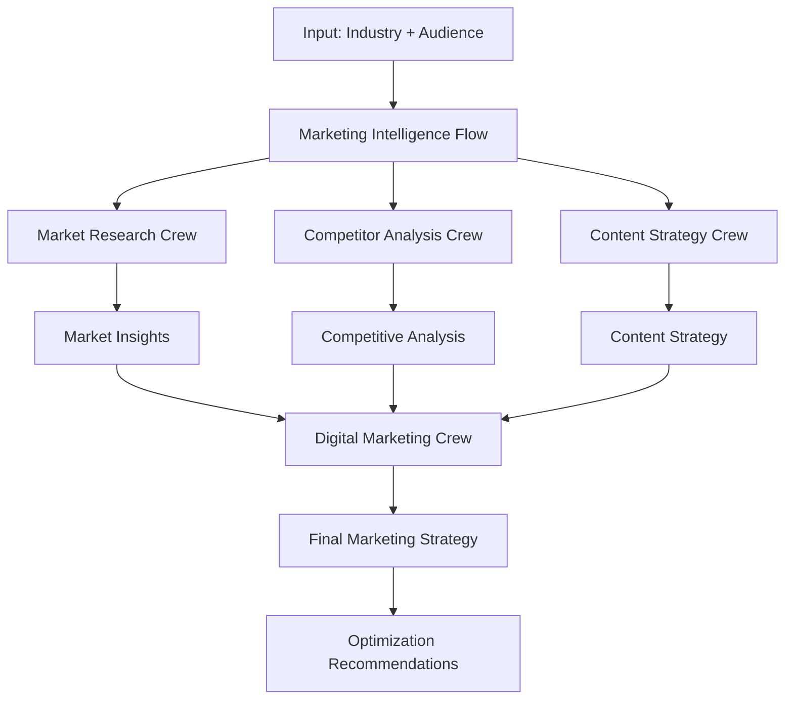

# 🤖 Marketing Multi-Agent System con CrewAI

[](https://www.python.org/downloads/)
[](https://github.com/crewAIInc/crewAI)
[](https://opensource.org/licenses/MIT)
[](https://github.com/psf/black)

Un sistema completo de marketing digital multi-agente desarrollado con **CrewAI** que proporciona análisis integral, estrategia competitiva y optimización de campañas mediante la colaboración de agentes especializados de IA.

## 🎯 Características Principales

### 🏗️ Arquitectura Multi-Dominio
- **Marketing Digital**: Análisis de mercado, competencia y optimización de campañas
- **SST (Seguridad y Salud en el Trabajo)**: Evaluación de riesgos, cumplimiento normativo e investigación de incidentes
- **Escalabilidad**: Fácil adición de nuevos dominios (finanzas, RRHH, etc.)
- **CLI Global**: Gestión unificada desde la raíz del repositorio

### 🤖 Dominio Marketing - Agentes Especializados
- **Market Researcher**: Análisis profundo de mercado y tendencias
- **Competitor Analyst**: Investigación competitiva y benchmarking
- **Marketing Strategist**: Desarrollo de estrategias integrales
- **Content Creator**: Creación y planificación de contenido
- **SEO Specialist**: Optimización para motores de búsqueda
- **Social Media Specialist**: Estrategias multi-plataforma
- **Data Analyst**: Análisis de métricas y performance
- **Campaign Manager**: Gestión y optimización de campañas
- **Copywriter**: Creación de copy persuasivo
- **Email Marketing Specialist**: Estrategias de email marketing

### 🦺 Dominio SST - Agentes Especializados
- **Risk Analyst**: Identificación y evaluación de riesgos laborales
- **Compliance Officer**: Verificación de cumplimiento normativo
- **Incident Investigator**: Análisis de causas raíz de incidentes
- **Safety Trainer**: Desarrollo de programas de capacitación

### 🚀 Flows Avanzados
**Marketing:**
- **Marketing Intelligence Flow**: Análisis completo end-to-end
- **Campaign Optimization Flow**: Optimización continua de campañas

**SST:**
- **Incident Investigation Flow**: Investigación sistemática de incidentes
- **Risk Assessment Flow**: Evaluación integral de riesgos

### 🛠️ Herramientas Personalizadas
**Marketing:**
- **Market Research**: Análisis de tendencias, insights de audiencia
- **Competitive Analysis**: Monitoreo y análisis competitivo  
- **Content Tools**: Generación de ideas, optimización SEO
- **Analytics**: Tracking de performance y cálculo de ROI

**SST:**
- **Regulatory Search**: Búsqueda de normativa aplicable
- **Risk Matrix**: Evaluación y priorización de riesgos
- **Incident Analytics**: Análisis de patrones de incidentes

## 📋 Tabla de Contenidos

- [Instalación](#-instalación)
- [Configuración](#-configuración)
- [Uso Rápido](#-uso-rápido)
- [Arquitectura](#-arquitectura)
- [Ejemplos](#-ejemplos)
- [API Reference](#-api-reference)
- [Casos de Uso](#-casos-de-uso)
- [Contribución](#-contribución)
- [Licencia](#-licencia)

## 🚀 Instalación

### Prerrequisitos
- Python 3.10 o superior
- Poetry (recomendado) o pip
- API keys para OpenAI y Serper

### Opción 1: Con Poetry (Recomendado)

```bash
# Clonar el repositorio
git clone https://github.com/tu-usuario/marketing-multiagent.git
cd marketing-multiagent

# Instalar dependencias con Poetry
poetry install

# Activar entorno virtual
poetry shell
```

### Opción 2: Con pip

```bash
# Clonar el repositorio
git clone https://github.com/tu-usuario/marketing-multiagent.git
cd marketing-multiagent

# Crear entorno virtual
python -m venv venv
source venv/bin/activate  # En Windows: venv\Scripts\activate

# Instalar dependencias
pip install -r requirements.txt
```

### Opción 3: Instalación Editable (Para Desarrollo)

```bash
# Después de clonar el repositorio
cd marketing-multiagent
pip install -e .
```

## ⚙️ Configuración

### 1. Variables de Entorno

Copia el archivo de ejemplo y configura tus API keys:

```bash
cp .env.example .env
```

### ⚠️ APIs de IA Generativa REQUERIDAS

**IMPORTANTE**: Este proyecto necesita acceso a APIs de IA generativa para funcionar. Los agentes de CrewAI requieren un LLM para ejecutar tareas.

Edita `.env` con tus credenciales:

```env
# 🤖 API de IA Generativa (OBLIGATORIA)
OPENAI_API_KEY=sk-tu-api-key-aqui

# 🔍 API de Búsqueda (OBLIGATORIA)
SERPER_API_KEY=tu-serper-api-key

# 🛠️ Configuración de CrewAI
CREWAI_TELEMETRY_OPT_OUT=true
CREWAI_LOG_LEVEL=INFO

# 📊 APIs Alternativas de LLM (OPCIONAL)
ANTHROPIC_API_KEY=tu-claude-api-key     # Para Claude
GOOGLE_API_KEY=tu-gemini-api-key        # Para Gemini
HUGGINGFACE_API_KEY=tu-hf-api-key       # Para modelos HF

# 🗄️ Base de Datos (Opcional)
DATABASE_URL=sqlite:///marketing_multiagent.db

# ⚙️ Configuración de la Aplicación
APP_NAME="Marketing Multi-Agent System"
APP_VERSION="1.0.0"
DEBUG=false
```

### 2. Obtener API Keys

#### OpenAI API Key
1. Visita [OpenAI Platform](https://platform.openai.com/)
2. Crea una cuenta o inicia sesión
3. Ve a API Keys y crea una nueva key
4. Copia el valor a `OPENAI_API_KEY`

#### Serper API Key (Para búsquedas web)
1. Visita [Serper.dev](https://serper.dev/)
2. Regístrate para obtener una API key gratuita
3. Copia el valor a `SERPER_API_KEY`

### 🧠 Opciones de Modelos de IA Generativa

El sistema soporta múltiples proveedores de LLM. **Necesitas al menos uno configurado**:

#### 1. 🟢 OpenAI (Recomendado)
- **Modelos**: GPT-4o, GPT-4, GPT-3.5-turbo
- **Ventajas**: Alta calidad, rápido, bien documentado
- **Costo**: Pago por uso ($0.01-0.06 por 1K tokens)
- **Configuración**: `OPENAI_API_KEY=sk-...`

#### 2. 🟣 Anthropic Claude
- **Modelos**: Claude-3.5-sonnet, Claude-3-haiku
- **Ventajas**: Excelente para análisis, contexto largo (200K tokens)
- **Costo**: Competitivo con OpenAI
- **Configuración**: `ANTHROPIC_API_KEY=sk-ant-...`

#### 3. 🔵 Google Gemini
- **Modelos**: Gemini-1.5-pro, Gemini-1.5-flash
- **Ventajas**: Multimodal, costo-efectivo, contexto ultra-largo
- **Costo**: Generoso nivel gratuito
- **Configuración**: `GOOGLE_API_KEY=...`

#### 4. 🟡 Hugging Face
- **Modelos**: Llama-3, Mixtral, Code Llama
- **Ventajas**: Open source, control total, sin censura
- **Costo**: Gratuito (con límites) o hosting propio
- **Configuración**: `HUGGINGFACE_API_KEY=hf_...`

#### 5. 🔷 Azure OpenAI
- **Modelos**: GPT-4, GPT-3.5 en Azure
- **Ventajas**: Compliance empresarial, regiones específicas
- **Configuración**: Variables de Azure AD

### 💰 Consideraciones de Costo

| Proveedor | Modelo | Costo por 1K tokens | Nivel Gratuito | Recomendado para |
|-----------|---------|---------------------|----------------|------------------|
| OpenAI | GPT-4o | $0.005/$0.015 | $5 crédito inicial | Producción, alta calidad |
| OpenAI | GPT-3.5-turbo | $0.001/$0.002 | $5 crédito inicial | Desarrollo, costo-efectivo |
| Anthropic | Claude-3.5-sonnet | $0.003/$0.015 | $5 crédito inicial | Análisis complejo, contexto largo |
| Google | Gemini-1.5-pro | $0.001/$0.003 | 15 req/min gratis | Desarrollo con contexto largo |
| Hugging Face | Llama-3-8B | $0.0002 | 1000 req/mes gratis | Experimentación, open source |

> **💡 Recomendación**: Comienza con Gemini (gratuito) para desarrollo y GPT-4o para producción.

### 3. Verificar Instalación

```bash
# Verificar dominios disponibles
python cli.py domains

# Verificar estado del marketing (específico)
python -m marketing_multiagent.main status
```

## 🎮 Uso Rápido

### CLI Global Multi-Dominio (Recomendado)

```bash
# Listar dominios disponibles
python cli.py domains

# Ver crews disponibles por dominio
python cli.py crews --domain marketing
python cli.py crews --domain sst

# Ver flows disponibles por dominio
python cli.py flows --domain marketing
python cli.py flows --domain sst

# Ejecutar crew de marketing
python cli.py run-crew --domain marketing --crew MarketResearchCrew \
    --inputs '{"industry":"fintech","target_audience":"small businesses"}'

# Ejecutar crew de SST
python cli.py run-crew --domain sst --crew RiskAssessmentCrew \
    --inputs '{"industry":"construction","target_audience":"construction workers"}'

# Ejecutar flow de marketing
python cli.py run-flow --domain marketing --flow MarketingIntelligenceFlow \
    --state '{"industry":"technology","target_audience":"developers"}'
```

### CLI Específico de Marketing (Compatible)

```bash
# Análisis completo de marketing
python -m marketing_multiagent.main analyze \
    --industry "technology" \
    --audience "business professionals" \
    --objectives "lead generation" \
    --budget "25000-75000"

# Optimización de campaña
python -m marketing_multiagent.main optimize-campaign \
    --name "Q4 Holiday Campaign" \
    --budget 50000 \
    --type "digital_ads"

# Ejecutar crew específico
python -m marketing_multiagent.main run-crew \
    --crew market-research \
    --industry "fintech" \
    --audience "small business owners"

# Ver ejemplos disponibles
python -m marketing_multiagent.main list-examples
```

### Uso Programático

#### Marketing Domain
```python
from marketing_multiagent.flows.marketing_intelligence_flow import (
    MarketingIntelligenceFlow,
    MarketingFlowState
)

# Configurar análisis de marketing
flow_state = MarketingFlowState(
    industry="fintech",
    target_audience="millennials professionals",
    marketing_objectives=["brand awareness", "lead generation"],
    budget_range="50000-100000",
    timeline="6 months"
)

# Ejecutar análisis completo
flow = MarketingIntelligenceFlow()
flow.state = flow_state
result = flow.kickoff()

print(f"Análisis completado con score: {flow_state.analysis_quality_score}")
```

#### SST Domain
```python
from sst_multiagent.crews.risk_assessment_crew import RiskAssessmentCrew
from sst_multiagent.flows.incident_investigation_flow import (
    IncidentInvestigationFlow,
    IncidentState
)

# Evaluar riesgos con crew de SST
risk_crew = RiskAssessmentCrew()
result = risk_crew.crew().kickoff(inputs={
    "industry": "construction",
    "target_audience": "construction workers",
    "marketing_objectives": "comprehensive risk assessment"
})

# Investigar incidente con flow de SST
incident_flow = IncidentInvestigationFlow()
incident_flow.state = IncidentState(
    site="Planta Manufacturing A",
    incident_type="lesión por corte",
    description="Trabajador se cortó con herramienta sin protección"
)
investigation_result = incident_flow.kickoff()
```

#### Multi-Domain Registry
```python
from multiagent.registry import registry

# Listar dominios disponibles
domains = registry.get_domains()
for domain in domains:
    print(f"{domain.key}: {domain.description}")

# Descubrir crews de un dominio
marketing_crews = registry.list_crews("marketing")
sst_crews = registry.list_crews("sst")
```

## 🏗️ Arquitectura

### Estructura del Proyecto

```
multi-agent/
├── src/                               # Código fuente
│   ├── multiagent/                    # Paquete global multi-dominio
│   │   ├── cli.py                     # CLI global
│   │   ├── registry.py               # Registro de dominios
│   │   └── config_loader.py          # Carga configuración
│   ├── marketing_multiagent/          # Dominio Marketing
│   │   ├── crews/                     # Crews especializados
│   │   ├── flows/                     # Flows de orquestación
│   │   ├── tools/                     # Herramientas personalizadas
│   │   └── main.py                    # CLI específico marketing
│   └── sst_multiagent/               # Dominio SST
│       ├── crews/                     # Crews SST
│       ├── flows/                     # Flows SST
│       └── tools/                     # Herramientas SST
├── config/                            # Configuraciones globales
│   ├── domains.yaml                   # Configuración de dominios
│   ├── marketing_agents.yaml           # Definición de agentes del dominio marketing
│   ├── marketing_tasks.yaml            # Definición de tareas del dominio marketing
│   ├── marketing_config.yaml           # Configuración técnica del dominio marketing
│   ├── sst_agents.yaml                 # Definición de agentes del dominio SST
│   ├── sst_tasks.yaml                  # Definición de tareas del dominio SST
│   ├── sst_config.yaml                 # Configuración técnica del dominio SST
│   └── domains.yaml                    # Registro central de dominios
├── examples/                          # Ejemplos por dominio
│   ├── fintech_startup_analysis.py   # Marketing
│   ├── ecommerce_campaign_optimization.py
│   ├── construction_risk_assessment.py # SST
│   └── README.md
├── cli.py                             # CLI global desde raíz
├── outputs/                           # Resultados generados
├── logs/                              # Archivos de log
├── requirements.txt                   # Dependencias Python
├── pyproject.toml                     # Configuración Poetry
└── .env.example                       # Template de variables
```

### Flujo de Datos


```mermaid
graph TD
    A[Input: Industry + Audience] --> B[Marketing Intelligence Flow]
    B --> C[Market Research Crew]
    B --> D[Competitor Analysis Crew]
    B --> E[Content Strategy Crew]
    C --> F[Market Insights]
    D --> G[Competitive Analysis]
    E --> H[Content Strategy]
    F --> I[Digital Marketing Crew]
    G --> I
    H --> I
    I --> J[Final Marketing Strategy]
    J --> K[Optimization Recommendations]
```

### Crews y Responsabilidades por Dominio

#### Marketing Domain
| Crew | Agentes Principales | Responsabilidad |
|------|-------------------|-----------------|
| **MarketResearchCrew** | Market Researcher, Data Analyst | Análisis de mercado, tendencias, insights de audiencia |
| **CompetitorAnalysisCrew** | Competitor Analyst, Marketing Strategist | Análisis competitivo, positioning, diferenciación |
| **ContentStrategyCrew** | Content Creator, SEO Specialist, Copywriter | Estrategia de contenido, SEO, copy |
| **DigitalMarketingCrew** | Campaign Manager, Social Media, Email Specialist | Campañas, social media, email marketing |

#### SST Domain
| Crew | Agentes Principales | Responsabilidad |
|------|-------------------|-----------------|
| **RiskAssessmentCrew** | Risk Analyst, Compliance Officer | Evaluación de riesgos, cumplimiento normativo |

## 📚 Ejemplos por Dominio

### Marketing Domain

#### Análisis para Startup Fintech
```bash
# Ejecutar ejemplo completo
python examples/fintech_startup_analysis.py
```
**Caso de Uso**: Startup fintech lanzando app de finanzas personales
- **Duración**: ~15 minutos
- **Output**: Estrategia go-to-market completa
- **Métricas**: Score de calidad, insights competitivos, recomendaciones

#### Optimización E-commerce
```bash
# Optimizar campaña existente
python examples/ecommerce_campaign_optimization.py
```
**Caso de Uso**: Mejorar ROAS de campaña holiday para fashion e-commerce
- **Duración**: ~10 minutos  
- **Output**: Plan de optimización detallado
- **Métricas**: Proyección de mejoras, ajustes recomendados

### SST Domain

#### Evaluación de Riesgos en Construcción
```bash
# Ejecutar evaluación de riesgos
python examples/construction_risk_assessment.py
```
**Caso de Uso**: Evaluación integral de riesgos en obra de construcción
- **Duración**: ~12 minutos
- **Output**: Matriz de riesgos y plan de medidas preventivas
- **Métricas**: Nivel de riesgo, estado de cumplimiento normativo

### Más Ejemplos Disponibles

**Marketing:**
- `saas_competitive_analysis.py`: Análisis competitivo para SaaS CRM
- `healthtech_content_strategy.py`: Estrategia de contenido para telemedicina

**SST:**
- `construction_risk_assessment.py`: Evaluación de riesgos en obra de construcción

Ver [examples/README.md](examples/README.md) para documentación completa.

## 🔌 API Reference

### CLI Global Multi-Dominio

#### Comandos Principales
```bash
# Gestión de dominios
python cli.py domains                    # Listar dominios disponibles
python cli.py crews --domain <domain>   # Listar crews de un dominio
python cli.py flows --domain <domain>   # Listar flows de un dominio

# Ejecución
python cli.py run-crew --domain <domain> --crew <CrewClass> --inputs '<json>'
python cli.py run-flow --domain <domain> --flow <FlowClass> --state '<json>'
```

### Flows por Dominio

#### Marketing Domain

**MarketingIntelligenceFlow**
```python
from marketing_multiagent.flows.marketing_intelligence_flow import (
    MarketingIntelligenceFlow,
    MarketingFlowState
)

# Configurar estado
state = MarketingFlowState(
    industry: str,                    # Industria objetivo
    target_audience: str,             # Descripción de audiencia
    marketing_objectives: List[str],  # Lista de objetivos
    budget_range: str,               # Rango de presupuesto
    timeline: str                    # Timeline del proyecto
)

# Ejecutar flow
flow = MarketingIntelligenceFlow()
flow.state = state
result = flow.kickoff()
```

**CampaignOptimizationFlow**
```python
from marketing_multiagent.flows.campaign_optimization_flow import (
    CampaignOptimizationFlow,
    CampaignOptimizationState
)

# Configurar optimización
state = CampaignOptimizationState(
    campaign_name: str,              # Nombre de campaña
    campaign_type: str,              # Tipo de campaña
    current_budget: float,           # Presupuesto actual
    target_metrics: Dict[str, float] # Métricas objetivo
)

# Ejecutar optimización
flow = CampaignOptimizationFlow()
flow.state = state
result = flow.kickoff()
```

#### SST Domain

**IncidentInvestigationFlow**
```python
from sst_multiagent.flows.incident_investigation_flow import (
    IncidentInvestigationFlow,
    IncidentState
)

# Configurar investigación
state = IncidentState(
    site: str,                       # Sitio del incidente
    incident_type: str,              # Tipo de incidente
    description: str,                # Descripción detallada
    witnesses: List[str] = [],       # Lista de testigos
    evidence: List[str] = []         # Evidencia recopilada
)

# Ejecutar investigación
flow = IncidentInvestigationFlow()
flow.state = state
result = flow.kickoff()
```

### Crews por Dominio

#### Marketing Crews
```python
from marketing_multiagent.crews.market_research_crew import MarketResearchCrew

crew = MarketResearchCrew()
result = crew.crew().kickoff(inputs={
    "industry": "fintech",
    "target_audience": "millennials",
    "marketing_objectives": "market analysis"
})
```

#### SST Crews
```python
from sst_multiagent.crews.risk_assessment_crew import RiskAssessmentCrew

crew = RiskAssessmentCrew()
result = crew.crew().kickoff(inputs={
    "industry": "construction",
    "target_audience": "construction workers",
    "marketing_objectives": "comprehensive risk assessment"
})
```

### Registry Multi-Dominio

```python
from multiagent.registry import registry

# Listar todos los dominios
domains = registry.get_domains()

# Obtener información de un dominio específico
marketing_info = registry.get("marketing")
sst_info = registry.get("sst")

# Descubrir crews y flows
marketing_crews = registry.list_crews("marketing")
sst_flows = registry.list_flows("sst")
```

### Herramientas Personalizadas

#### Marketing Tools
```python
from marketing_multiagent.tools.market_research_tools import TrendAnalysisTool

# Usar herramienta directamente
tool = TrendAnalysisTool()
result = tool._run(
    industry="technology",
    time_period="last_6_months"
)
```

#### SST Tools
```python
from sst_multiagent.tools.regulatory_search_tool import RegulatorySearchTool

# Buscar normativa aplicable
tool = RegulatorySearchTool()
result = tool._run(
    query="equipos de protección individual",
    country="ES"
)
```

## 🎯 Casos de Uso por Dominio

### Marketing Domain

#### Por Industria
**Tecnología y SaaS**
- **Análisis competitivo** para diferenciación de producto
- **Estrategia de contenido** para thought leadership
- **Optimización de funnel** B2B

**E-commerce y Retail**
- **Optimización de campañas** estacionales
- **Análisis de audiencia** para segmentación
- **Estrategia omnicanal** integrada

**Fintech y Servicios Financieros**
- **Estrategia de confianza** y credibilidad
- **Educación de mercado** sobre productos financieros
- **Compliance** en comunicación de marketing

**Salud y Bienestar**
- **Contenido educativo** médicamente preciso
- **Estrategias de confianza** para pacientes
- **Compliance** con regulaciones de salud

#### Por Objetivo de Marketing

**Generación de Leads**
```bash
python cli.py run-flow --domain marketing --flow MarketingIntelligenceFlow \
    --state '{"marketing_objectives":["lead generation","qualification improvement"]}'
```

**Brand Awareness**
```bash
python cli.py run-flow --domain marketing --flow MarketingIntelligenceFlow \
    --state '{"marketing_objectives":["brand awareness","thought leadership"]}'
```

**Optimización de Conversión**
```bash
python cli.py run-flow --domain marketing --flow CampaignOptimizationFlow \
    --state '{"target_metrics":{"cvr":5.0,"cpa":50.0}}'
```

### SST Domain

#### Por Industria
**Construcción**
- **Evaluación de riesgos** en obras y alturas
- **Cumplimiento normativo** RD 1627/1997
- **Investigación de incidentes** y planes correctivos

**Manufactura**
- **Análisis de riesgos** en maquinaria y procesos
- **Compliance** ISO 45001
- **Programas de capacitación** específicos

**Servicios**
- **Evaluación ergonómica** de puestos de trabajo
- **Riesgos psicosociales** y bienestar laboral
- **Planes de emergencia** y evacuación

#### Por Objetivo de SST

**Evaluación de Riesgos**
```bash
python cli.py run-crew --domain sst --crew RiskAssessmentCrew \
    --inputs '{"industry":"construction","target_audience":"construction workers"}'
```

**Investigación de Incidentes**
```bash
python cli.py run-flow --domain sst --flow IncidentInvestigationFlow \
    --state '{"site":"Planta A","incident_type":"corte","description":"Lesión con herramienta"}'
```

**Compliance Normativo**
```bash
python cli.py run-crew --domain sst --crew RiskAssessmentCrew \
    --inputs '{"industry":"manufacturing","marketing_objectives":"ISO 45001 compliance"}'
```

## 📊 Métricas y KPIs por Dominio

### Métricas de Sistema (Global)
- **Analysis Quality Score**: Puntuación de calidad del análisis (0-100)
- **Completion Status**: Estado de cada componente del análisis
- **Processing Time**: Tiempo de ejecución de cada crew
- **Domain Coverage**: Dominios activos y utilizados

### Métricas de Marketing
- **ROAS**: Return on Ad Spend
- **CTR**: Click Through Rate  
- **CVR**: Conversion Rate
- **CPA**: Cost Per Acquisition
- **LTV**: Customer Lifetime Value

### Métricas de SST
- **Risk Level**: Nivel de riesgo evaluado (Bajo/Medio/Alto/Crítico)
- **Compliance Score**: Porcentaje de cumplimiento normativo
- **Incident Severity**: Gravedad de incidentes (Menor/Mayor/Crítico)
- **Prevention Effectiveness**: Efectividad de medidas preventivas

### Outputs Generados por Dominio

```
outputs/
# Marketing Domain
├── marketing_analysis_[industry].md      # Análisis completo
├── campaign_optimization_[name].json     # Plan de optimización  
├── competitive_analysis_[industry].md    # Análisis competitivo
├── content_strategy_[industry].md        # Estrategia de contenido
# SST Domain
├── risk_assessment_[site].md             # Evaluación de riesgos
├── incident_investigation_[case].md      # Investigación de incidentes
├── compliance_report_[standard].md       # Reporte de cumplimiento
# Global
└── reports/
    ├── performance_metrics.csv
    ├── detailed_insights.json
    └── domain_summary.json
```

## 🔧 Configuración Avanzada

### Configuración Multi-Dominio

#### Habilitar/Deshabilitar Dominios
Modifica `config/domains.yaml`:

```yaml
domains:
  marketing:
    enabled: true
    package: marketing_multiagent
    description: "Dominio de Marketing Digital"
    crews_module: marketing_multiagent.crews
    flows_module: marketing_multiagent.flows

  sst:
    enabled: true  # Cambiar a false para deshabilitar
    package: sst_multiagent
    description: "Dominio de Seguridad y Salud en el Trabajo (SST)"
    crews_module: sst_multiagent.crews
    flows_module: sst_multiagent.flows

  # Agregar nuevos dominios aquí
  finance:
    enabled: false
    package: finance_multiagent
    description: "Dominio Financiero (Futuro)"
```

### Personalizar Agentes por Dominio

#### Marketing Agents
Modifica el archivo de configuración de agentes correspondiente al dominio (ej: `config/marketing_agents.yaml`):

```yaml
# Marketing Domain
custom_marketing_agent:
  role: "Custom Marketing Agent"
  goal: "Achieve specific marketing objective"
  backstory: "Detailed background and expertise"
  verbose: true
  memory: true
  allow_delegation: false

# SST Domain  
custom_sst_agent:
  role: "Custom Safety Agent"
  goal: "Ensure workplace safety compliance"
  backstory: "Expert in occupational safety and health regulations"
  verbose: true
  memory: true
  allow_delegation: false
```

### Añadir Herramientas Personalizadas por Dominio

#### Marketing Tools
```python
from crewai_tools import BaseTool
from pydantic import BaseModel, Field

class CustomMarketingTool(BaseTool):
    name: str = "Custom Marketing Tool"
    description: str = "Performs custom marketing analysis"
    
    class CustomInputSchema(BaseModel):
        parameter: str = Field(description="Input parameter")
    
    args_schema: Type[BaseModel] = CustomInputSchema
    
    def _run(self, parameter: str) -> str:
        # Tu lógica personalizada de marketing
        return f"Marketing analysis result for {parameter}"
```

#### SST Tools
```python
from crewai_tools import BaseTool
from pydantic import BaseModel, Field

class CustomSSTTool(BaseTool):
    name: str = "Custom SST Tool"
    description: str = "Performs custom safety analysis"
    
    class CustomInputSchema(BaseModel):
        hazard_type: str = Field(description="Type of hazard to analyze")
        site_location: str = Field(description="Site location")
    
    args_schema: Type[BaseModel] = CustomInputSchema
    
    def _run(self, hazard_type: str, site_location: str) -> str:
        # Tu lógica personalizada de SST
        return f"Safety analysis for {hazard_type} at {site_location}"
```

### Configurar Flows Personalizados por Dominio

#### Marketing Flow
```python
from crewai.flow.flow import Flow, listen, start
from marketing_multiagent.crews.market_research_crew import MarketResearchCrew

class CustomMarketingFlow(Flow):
    
    @start()
    def initialize_analysis(self):
        # Lógica de inicialización de marketing
        return {"status": "initialized", "domain": "marketing"}
    
    @listen(initialize_analysis)
    def execute_research(self, context):
        crew = MarketResearchCrew()
        result = crew.crew().kickoff(inputs=context)
        return result
```

#### SST Flow
```python
from crewai.flow.flow import Flow, listen, start
from sst_multiagent.crews.risk_assessment_crew import RiskAssessmentCrew

class CustomSSTFlow(Flow):
    
    @start()
    def initialize_assessment(self):
        # Lógica de inicialización de SST
        return {"status": "initialized", "domain": "sst"}
    
    @listen(initialize_assessment)
    def execute_risk_assessment(self, context):
        crew = RiskAssessmentCrew()
        result = crew.crew().kickoff(inputs=context)
        return result
```

### Registrar Nuevos Dominios

```python
from multiagent.registry import registry

# Registrar un nuevo dominio
registry.register(
    key="finance",
    package="finance_multiagent",
    description="Dominio de Análisis Financiero",
    crews_module="finance_multiagent.crews",
    flows_module="finance_multiagent.flows"
)
```

## 🧪 Testing y Validación

### Ejecutar Tests

```bash
# Tests unitarios
pytest tests/

# Tests de integración
pytest tests/integration/

# Tests con coverage
pytest --cov=marketing_multiagent tests/
```

### Validar Configuración

```bash
# Verificar estado del sistema
python -m marketing_multiagent.main status

# Validar configuración de agentes
python -c "from marketing_multiagent.crews import *; print('✅ Crews loaded successfully')"

# Test de conectividad API
python -c "import openai; openai.api_key='test'; print('✅ OpenAI configured')"
```

## 📈 Performance y Optimización

### Tiempos de Ejecución Típicos

| Operación | Duración Promedio |
|-----------|------------------|
| Market Research Crew | 5-8 minutos |
| Competitor Analysis Crew | 3-6 minutos |
| Content Strategy Crew | 4-7 minutos |
| Full Marketing Intelligence Flow | 15-25 minutos |
| Campaign Optimization Flow | 8-15 minutos |

### Optimización de Performance

```python
# Configurar parallel execution
crew.crew(
    memory=True,
    verbose=True,
    process=Process.parallel  # Ejecutar tareas en paralelo
)

# Usar cache para herramientas
@lru_cache(maxsize=100)
def cached_analysis(industry: str):
    # Lógica con cache
    pass
```

### Monitoreo y Logs

```python
import logging

# Configurar logging detallado
logging.basicConfig(
    level=logging.INFO,
    format='%(asctime)s - %(name)s - %(levelname)s - %(message)s',
    handlers=[
        logging.FileHandler('logs/marketing_multiagent.log'),
        logging.StreamHandler()
    ]
)
```

## 🚀 Despliegue en Producción

### Docker

```dockerfile
FROM python:3.10-slim

WORKDIR /app
COPY requirements.txt .
RUN pip install -r requirements.txt

COPY . .
CMD ["python", "-m", "marketing_multiagent.main"]
```

### Docker Compose

```yaml
version: '3.8'
services:
  marketing-multiagent:
    build: .
    environment:
      - OPENAI_API_KEY=${OPENAI_API_KEY}
      - SERPER_API_KEY=${SERPER_API_KEY}
    volumes:
      - ./outputs:/app/outputs
      - ./logs:/app/logs
```

### API Server

```python
from fastapi import FastAPI
from marketing_multiagent.flows.marketing_intelligence_flow import MarketingIntelligenceFlow

app = FastAPI(title="Marketing Multi-Agent API")

@app.post("/analyze")
async def analyze_marketing(request: MarketingAnalysisRequest):
    flow = MarketingIntelligenceFlow()
    flow.state = MarketingFlowState(**request.dict())
    result = flow.kickoff()
    return {"result": result, "score": flow.state.analysis_quality_score}
```

## 🤝 Contribución

¡Las contribuciones son bienvenidas! Por favor lee nuestro [CONTRIBUTING.md](CONTRIBUTING.md) para detalles sobre nuestro código de conducta y el proceso para enviar pull requests.

### Desarrollo Local

```bash
# Fork y clonar el repositorio
git clone https://github.com/tu-usuario/marketing-multiagent.git
cd marketing-multiagent

# Crear rama de feature
git checkout -b feature/nueva-funcionalidad

# Instalar dependencias de desarrollo
poetry install --with dev

# Ejecutar pre-commit hooks
pre-commit install

# Hacer cambios y commits
git add .
git commit -m "feat: añadir nueva funcionalidad"

# Push y crear PR
git push origin feature/nueva-funcionalidad
```

### Guías de Contribución

1. **Código**: Sigue PEP 8 y usa Black para formateo
2. **Tests**: Añade tests para nueva funcionalidad
3. **Documentación**: Actualiza README y docstrings
4. **Commits**: Usa conventional commits (feat:, fix:, docs:)

## 📄 Licencia

Este proyecto está licenciado bajo la Licencia MIT - ver el archivo [LICENSE](LICENSE) para detalles.

## 🆘 Soporte

### Documentación
- [Documentación de CrewAI](https://docs.crewai.com/)
- [Guía de Instalación Detallada](docs/installation.md)
- [API Reference Completa](docs/api-reference.md)

### Comunidad
- [GitHub Issues](https://github.com/tu-usuario/marketing-multiagent/issues): Reportar bugs
- [GitHub Discussions](https://github.com/tu-usuario/marketing-multiagent/discussions): Preguntas y discusión
- [Discord Community](https://discord.gg/crewai): Comunidad CrewAI

### FAQ

**P: ⚠️ ¿El proyecto necesita APIs de IA Generativa?**  
R: **SÍ, es OBLIGATORIO**. Los agentes de CrewAI requieren un modelo de lenguaje (LLM) para funcionar. Necesitas al menos una API configurada: OpenAI, Google Gemini, Anthropic Claude, etc. Ver [guía de configuración](docs/api-setup-guide.md).

**P: ¿Cuál es la opción más económica para empezar?**  
R: Google Gemini es GRATIS hasta 15 requests/minuto. Perfecto para desarrollo y pruebas. Para producción recomendamos OpenAI GPT-4o por su calidad.

**P: ¿Cuánto cuesta ejecutar el sistema?**  
R: Con Gemini: GRATIS. Con OpenAI: ~$0.50-2.00 por análisis completo. Ver [tabla de costos](docs/api-setup-guide.md#-comparación-de-costos-por-1m-tokens).

**P: ¿Puedo usar otros LLMs además de OpenAI?**  
R: Sí, soportamos OpenAI, Anthropic Claude, Google Gemini, Hugging Face, Groq y más. Configura en los archivos de agentes específicos del dominio.

**P: ¿El sistema funciona en otros idiomas?**  
R: Sí, puedes configurar agentes para trabajar en español, francés, etc. Los LLMs modernos son multilingües.

## 🎉 Agradecimientos

- **CrewAI Team**: Por el increíble framework de multi-agentes
- **OpenAI**: Por los modelos GPT de alta calidad  
- **Comunidad Open Source**: Por las herramientas y librerías utilizadas

---

**Desarrollado con ❤️ usando CrewAI**

*¿Te gusta este proyecto? ¡Dale una ⭐ en GitHub!*