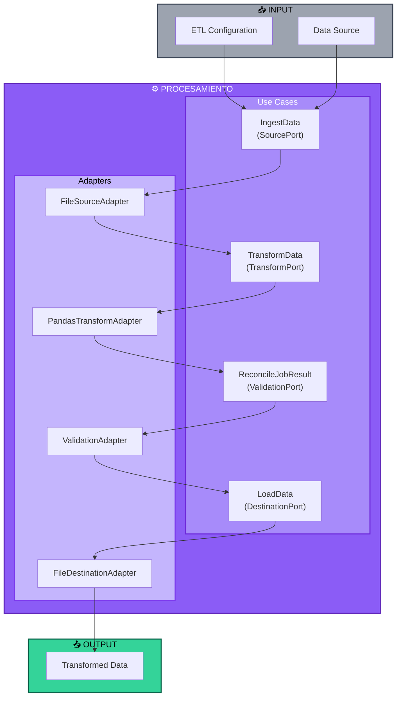

# Arquitectura Hexagonal - Dominio ETL Multi-Agente

**Estado Actual**: MVP con casos de uso funcionales. CrewAI Flow y Crew están disponibles como extensión opcional.

## Diagrama de Flujo (Mermaid)



## Diagrama Textual (Pseudo-C4)

```
┌─────────────────────────────────────────────────────────────────┐
│                    CAPA DE ENTRADA (Driving)                     │
├─────────────────────────────────────────────────────────────────┤
│  • CLI Global (multiagent CLI)                                   │
│  • Scripts (demo_etl.py, ejemplos)                              │
│  • API REST (futuro)                                            │
└────────────────────────┬────────────────────────────────────────┘
                         │
                         │ invoca
                         ▼
┌─────────────────────────────────────────────────────────────────┐
│              CAPA DE ORQUESTACIÓN (Application)                  │
├─────────────────────────────────────────────────────────────────┤
│  • ETLPipelineFlow (CrewAI Flow - Disponible pero no usado)     │
│    - ingest_source → transform_data → validate_quality →        │
│      load_destination                                           │
│                                                                  │
│  • ETLOrchestrationCrew (CrewAI Crew - 5 agentes básicos)       │
│    - orchestrator_agent, source_agent, transform_agent,         │
│      validation_agent, loader_agent                             │
│                                                                  │
│  ✅ IMPLEMENTACIÓN ACTUAL (Demo):                               │
│    - Ejecución directa de Use Cases sin LLMs                    │
│    - FileSourceAdapter → PandasTransformAdapter →               │
│      ValidationAdapter → FileDestinationAdapter                 │
└────────────────────────┬────────────────────────────────────────┘
                         │
                         │ usa
                         ▼
┌─────────────────────────────────────────────────────────────────┐
│                   NÚCLEO DE DOMINIO (Core)                       │
├─────────────────────────────────────────────────────────────────┤
│  ENTIDADES:                                                      │
│    • DataSource: name, kind, uri, format, options               │
│    • DataBatch: raw, schema, stats, metadata                    │
│    • TransformationJob: source_schema, target_schema, mappings  │
│    • DataDestination: name, kind, uri, format, options          │
│                                                                  │
│  CASOS DE USO (Use Cases):                                      │
│    • IngestData(source_port) → DataBatch                        │
│    • TransformData(transform_port) → DataBatch                  │
│    • LoadData(destination_port) → dict                          │
│    • ReconcileJobResult(validation_port) → dict                 │
│                                                                  │
│  REGLAS DE NEGOCIO:                                             │
│    - Validación de formatos soportados                          │
│    - Políticas de calidad de datos (nulls, duplicados)          │
│    - Estrategias de retry y autocorrección                      │
└────────────────────────┬────────────────────────────────────────┘
                         │
                         │ define
                         ▼
┌─────────────────────────────────────────────────────────────────┐
│                    PUERTOS (Interfaces)                          │
├─────────────────────────────────────────────────────────────────┤
│  • SourcePort: read(source) → DataBatch                         │
│  • TransformPort: apply(batch, job) → DataBatch                 │
│  • ValidationPort: validate(batch, rules) → dict                │
│  • DestinationPort: write(batch, dest) → dict                   │
│  • OrchestrationPort: coordinate(workflow) → dict               │
└────────────────────────┬────────────────────────────────────────┘
                         │
                         │ implementado por
                         ▼
┌─────────────────────────────────────────────────────────────────┐
│               ADAPTADORES (Driven - Infraestructura)             │
├─────────────────────────────────────────────────────────────────┤
│  FUENTES (Sources):                                             │
│    • FileSourceAdapter: CSV, Parquet, Excel                     │
│    • S3SourceAdapter: S3/GCS buckets (stub)                     │
│    • DatabaseSourceAdapter: Postgres, MySQL (stub)              │
│                                                                  │
│  TRANSFORMADORES:                                               │
│    • PandasTransformAdapter: mappings, type casting             │
│    • ValidationAdapter: nulls, duplicates, rules                │
│                                                                  │
│  DESTINOS (Destinations):                                       │
│    • FileDestinationAdapter: CSV, Parquet, Excel                │
│    • PostgresDestinationAdapter: tablas relacionales (stub)     │
│    • BigQueryDestinationAdapter: data warehouse (stub)          │
└─────────────────────────────────────────────────────────────────┘
```

## Flujo de Datos (Implementación Actual)

1. **Usuario** → Script Python (`demo_etl.py`) con parámetros
2. **Use Case (IngestData)** → Llama SourcePort.read() vía adaptador
3. **Adaptador (FileSourceAdapter)** → Lee archivo y retorna DataBatch
4. **Use Case (TransformData)** → Llama TransformPort.apply() con job
5. **Adaptador (PandasTransformAdapter)** → Aplica mappings y retorna DataBatch transformado
6. **Use Case (ReconcileJobResult)** → Llama ValidationPort.validate()
7. **Adaptador (ValidationAdapter)** → Ejecuta checks y retorna reporte
8. **Use Case (LoadData)** → Llama DestinationPort.write()
9. **Adaptador (FileDestinationAdapter)** → Escribe archivo y retorna confirmación

**Nota**: Esta implementación es síncrona, lineal y sin dependencias de LLMs. Ideal para pipelines determinísticos.

## Principios Hexagonales Aplicados

1. **Independencia de Frameworks**: El dominio no conoce CrewAI, pandas, ni adaptadores concretos.
2. **Testabilidad**: Los casos de uso se testean con mocks de puertos.
3. **Intercambiabilidad**: Cambiar de pandas a Polars solo requiere nuevo adaptador.
4. **Extensibilidad**: Nuevos sources/destinos se agregan como adaptadores sin tocar dominio.
5. **Inversión de Dependencias**: Dominio define puertos, infraestructura los implementa.

## Componentes Clave

### Núcleo de Dominio
- **Entidades**: Representan conceptos ETL (fuentes, lotes, transformaciones, destinos)
- **Casos de Uso**: Orquestan lógica de negocio independiente de tecnología
- **Reglas**: Validación, calidad, estrategias de error

### Puertos
- **Contratos**: Interfaces Protocol que definen operaciones
- **Desacoplamiento**: Dominio no depende de implementaciones

### Adaptadores
- **Entrada (Driving)**: CLI, API, schedulers
- **Salida (Driven)**: Archivos, DBs, cloud storage, LLMs

### Orquestación
- **CrewAI Flow**: Secuencia declarativa de steps con estado compartido
- **CrewAI Crew**: Agentes especializados que colaboran en tareas ETL
