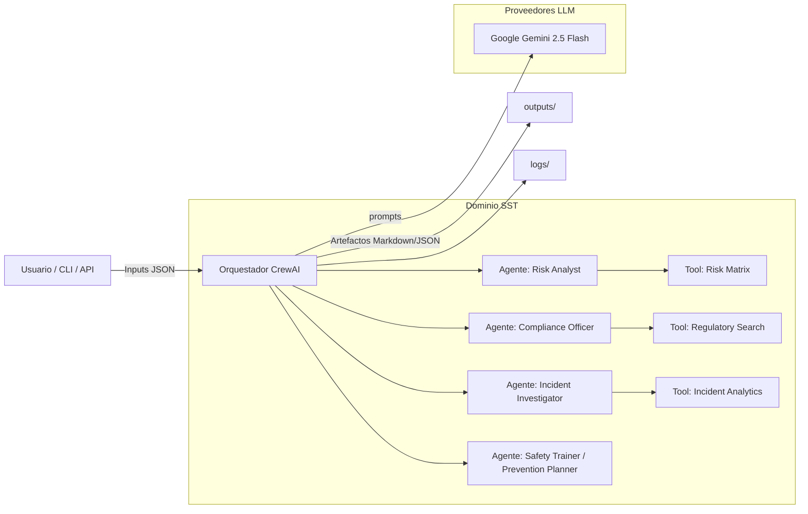
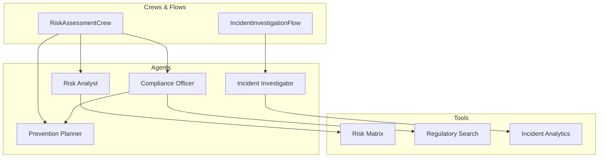
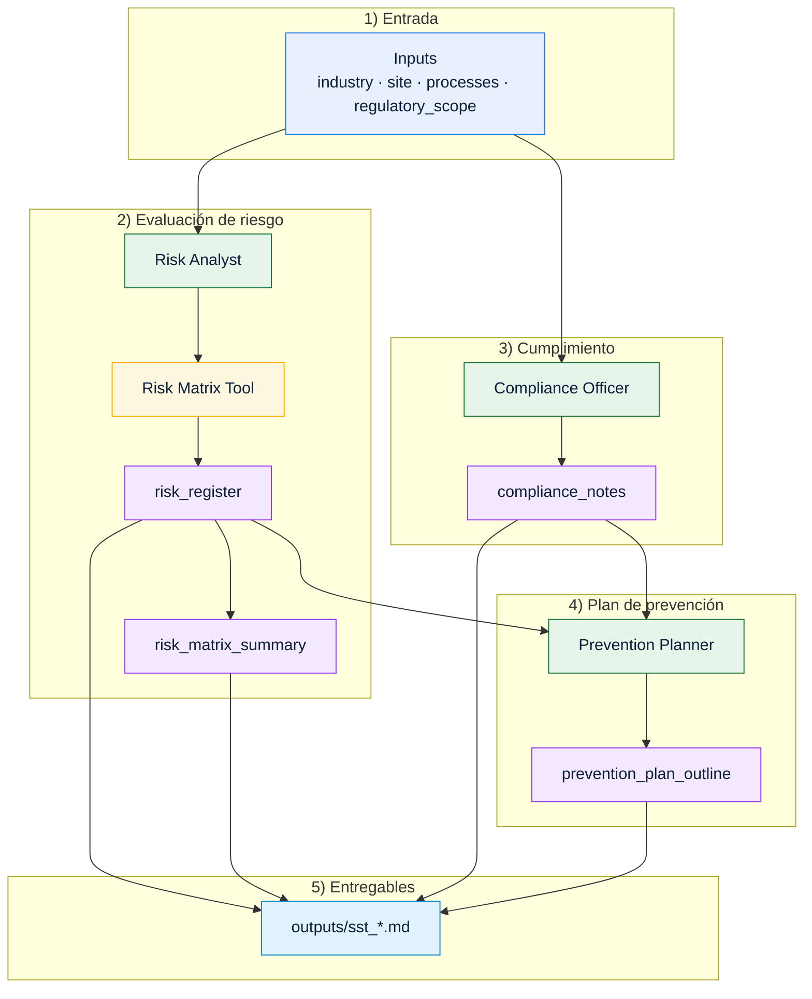
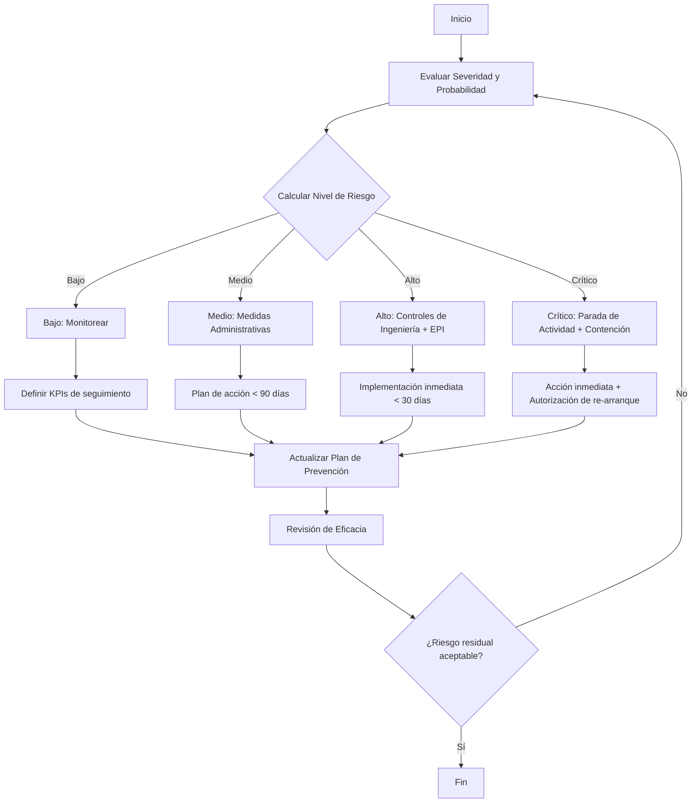
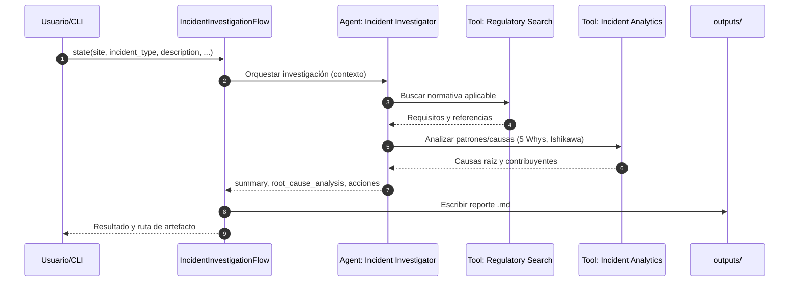
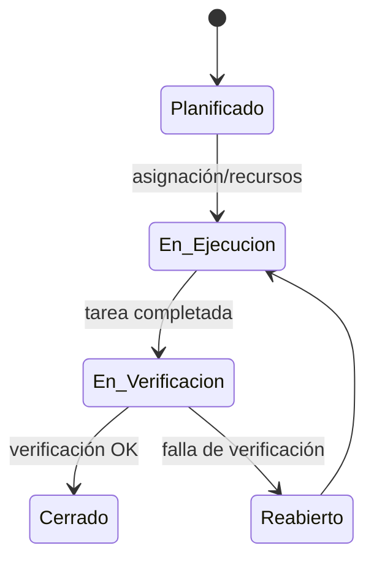

# SST Multi-Agent (Seguridad y Salud en el Trabajo)

Este documento describe el dominio SST del sistema multi‑agente, su estado actual, arquitectura, contratos de entrada/salida, ejemplos de uso y un roadmap de evolución. Está pensado para equipos de SST, HSE y Compliance que buscan automatizar evaluaciones de riesgo, investigaciones de incidentes y verificación normativa.

## Resumen ejecutivo

- Estado: base funcional lista para ejecutar demos y primeros flujos con Google Gemini 2.5 Flash.
- Enfoque: análisis estructurado, cumplimiento normativo y planes preventivos accionables.
- Tecnologías: CrewAI (orquestación multi‑agente), LiteLLM, Google Gemini 2.5 (gratuito), Python 3.10+.
- Resultados esperados: matriz de riesgos, reporte de cumplimiento y plan de prevención con cronograma y KPIs.

## Casos de uso cubiertos hoy

- Evaluación inicial de riesgos (por industria/actividad)
- Chequeo de cumplimiento normativo de alto nivel
- Plan de prevención a 6‑12 meses
- Investigación de incidentes (flujo inicial)

Demos funcionales de referencia:
- `python demos/demo_sst.py` → Evaluación de riesgos + compliance + plan preventivo (3 agentes)

## Arquitectura y componentes

- CrewAI como orquestador de tareas y agentes.
- LLM provider: Google Gemini 2.5 Flash vía LiteLLM con clave en `.env` (GOOGLE_API_KEY).
- Dominio: `sst_multiagent` bajo `src/` con submódulos para crews, flows y tools.

Componentes previstos/actuales:
- Agentes SST (especializados)
  - Risk Analyst: identifica y evalúa peligros/riesgos.
  - Compliance Officer: mapea normativa aplicable y brechas.
  - Incident Investigator: estructura investigación y causas raíz.
  - Safety Trainer / Prevention Planner: prioriza medidas y programa capacitación.
- Flows SST
  - Risk Assessment Flow: evaluación integral y priorización de riesgos.
  - Incident Investigation Flow: investigación sistemática (5 Whys, Ishikawa, CAPA).
- Tools SST
  - Regulatory Search: búsqueda y mapeo normativo (EPI, RD, ISO 45001, etc.).
  - Risk Matrix: cálculo/severidad/probabilidad y ranking de riesgos.
  - Incident Analytics: patrones, causas contributivas y acciones correctivas.

## Diagramas de solución y flujo

### Visión general de la solución (Contexto)



### Arquitectura lógica del dominio SST



### Flujo de datos: Evaluación de Riesgos (Crew)



### Decisiones y umbrales de criticidad (Risk Assessment)



### Secuencia: Investigación de Incidentes (Flow)



### Estado: Ciclo de acciones preventivas/correctivas



## Contratos de entrada/salida

Los contratos son guías para integrar UI/CLI/API y mantener consistencia. Los campos marcados con ? son opcionales.

1) RiskAssessmentCrew
- Input
  - industry: str (ej. "construction", "manufacturing")
  - site?: str (ej. "Obra Centro A")
  - processes?: List[str] (ej. ["corte", "soldadura", "altura"]) 
  - regulatory_scope?: List[str] (ej. ["RD 1627/1997", "ISO 45001"])
  - language?: str (default: "es")
- Output
  - risk_register: List[{
      hazard: str, context: str, severity: str|int, likelihood: str|int,
      risk_level: str|int, current_controls: List[str], recommended_actions: List[str]
    }]
  - risk_matrix_summary: {levels: Dict[str,int], top_risks: List[str]}
  - compliance_notes: List[str]
  - prevention_plan_outline: {phases: List[str], milestones: List[str]}

2) IncidentInvestigationFlow
- Input
  - site: str
  - incident_type: str (ej. "corte", "caída", "golpe")
  - description: str
  - date?: str (YYYY-MM-DD)
  - witnesses?: List[str]
  - evidence?: List[str]
  - language?: str (default: "es")
- Output
  - summary: str
  - root_cause_analysis: {method: "5-whys"|"fishbone", causes: List[str]}
  - corrective_actions: List[{action: str, owner: str?, due_date: str?}]
  - kpis_followup: List[str]

## Configuración de LLM

- Modelo recomendado: "gemini/gemini-2.5-flash" (rápido y gratuito)
- Variables de entorno (.env):
  - GOOGLE_API_KEY=...
- Telemetría/logs CrewAI: `CREWAI_TELEMETRY_OPT_OUT=true`, `CREWAI_LOG_LEVEL=INFO`

## Ejecución rápida (CLI y Demos)

- Demo SST (recomendado para validar entorno):
  - PowerShell (Windows):
    ```pwsh
    python demos/demo_sst.py
    ```
  - Salida esperada: archivo Markdown en `outputs/` con matriz de riesgos, notas de cumplimiento y plan de 12 meses.

- CLI Global (cuando esté registrado el dominio SST en `config/domains.yaml`):
  ```pwsh
  # Listar crews del dominio SST
  python cli.py crews --domain sst

  # Ejecutar RiskAssessmentCrew
  python cli.py run-crew --domain sst --crew RiskAssessmentCrew \
      --inputs '{"industry":"construction","target_audience":"construction workers"}'

  # Ejecutar IncidentInvestigationFlow
  python cli.py run-flow --domain sst --flow IncidentInvestigationFlow \
      --state '{"site":"Planta A","incident_type":"corte","description":"Lesión con herramienta"}'
  ```

## KPIs y reporting

- Risk Level distribution (Bajo/Medio/Alto/Crítico)
- Compliance Score (% de requisitos cumplidos vs. mapeados)
- Action Closure Rate (% de acciones preventivas/correctivas cerradas)
- Incident Recurrence (tendencia post‑CAPA)
- Training Coverage (% de población capacitada vs. objetivo)

Outputs sugeridos en `outputs/`:
- `risk_assessment_[site].md`
- `incident_investigation_[case].md`
- `compliance_report_[standard].md`

## Matriz RACI (roles vs entregables)

| Entregable / Actividad                    | Risk Analyst | Compliance Officer | Incident Investigator | Prevention Planner | Stakeholder (HSE/Operaciones) |
|-------------------------------------------|:------------:|:------------------:|:---------------------:|:------------------:|:-----------------------------:|
| Identificación de peligros                 | R            | C                  | C                     | I                  | A                             |
| Evaluación y nivel de riesgo (IPER)        | A            | C                  | I                     | C                  | I                             |
| Matriz de riesgos                          | A            | C                  | I                     | C                  | I                             |
| Mapeo normativo aplicable                  | C            | A                  | I                     | I                  | I                             |
| Notas de cumplimiento y brechas            | C            | A                  | I                     | C                  | I                             |
| Investigación de incidentes                | I            | C                  | A                     | I                  | C                             |
| Análisis de causa raíz (5 Whys/Ishikawa)   | C            | C                  | A                     | I                  | I                             |
| Plan de acciones correctivas               | C            | C                  | A                     | C                  | A                             |
| Plan de prevención (cronograma + KPIs)     | C            | C                  | I                     | A                  | A                             |
| Capacitación y sensibilización             | I            | C                  | I                     | A                  | A                             |
| Seguimiento de KPIs/eficacia               | C            | C                  | C                     | A                  | A                             |

Leyenda: R = Responsible, A = Accountable, C = Consulted, I = Informed

## Seguridad, privacidad y cumplimiento

- Minimizar PII: describir roles y funciones, no datos médicos personales.
- Cifrar/ocultar claves API (.env; nunca commitear). 
- Logs con sanitización de prompts cuando sea posible.
- Trazabilidad: guardar artefactos (archivos .md, resúmenes) en `outputs/`.
- Revisiones humanas: los reportes son asistidos por IA y requieren validación experta.

## Roadmap de evolución

Corto plazo (1‑2 sprints)
- Formalizar `RiskAssessmentCrew` y `IncidentInvestigationFlow` en `src/sst_multiagent/...`
- Definir YAMLs específicos: `config/sst_agents.yaml`, `config/sst_tasks.yaml`, `config/sst_config.yaml`
- Alinear el agente "Prevention Planner" como rol formal (o integrar en Safety Trainer)
- Añadir tests básicos: contratos de IO y generación de artefactos en `outputs/`
- Comando CLI dedicado para SST (alias convenientes)

Medio plazo (3‑6 sprints)
- Conector de normativa (BOE/INSST/INSST‑NTP) con caching local
- Ingesta de PDFs internos (procedimientos, ATS, IPER) + vector search
- Flow de Compliance Audit (ISO 45001, OHSAS) con checklist y scoring
- Dashboard de KPIs y seguimiento de acciones (CSV/JSON + exportación)
- Multi‑idioma sólido (es/en/pt) y plantillas locales por país

Largo plazo
- Integración con sistemas EHS (API) y SSO
- Agente de simulación de escenarios (what‑if) para priorización de inversiones preventivas
- Controles de calidad automáticos (lint de prompts, verificación de claims normativos)

## Notas de implementación

- Preferir prompts con contexto estructurado (industria, proceso, normativa) para respuestas consistentes.
- Limitar longitud de salida cuando se use en UI; guardar el detalle completo en `outputs/`.
- Para producción, considerar Gemini 2.5 Pro o modelos equivalentes con mayores garantías.

---

Última actualización: 2025-10-17
